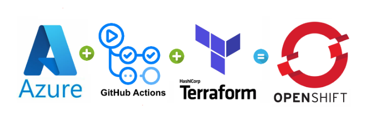
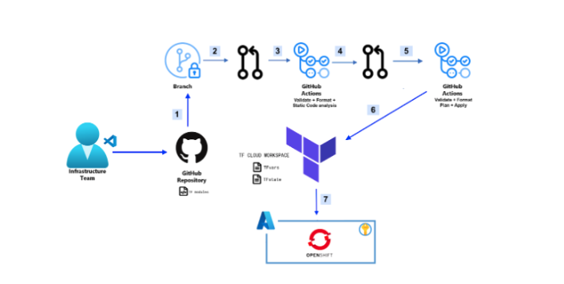

# Terraforming  Azure Red Hat OpenShift(ARO) with GitHub Actions

Deploying Azure RedHat Openshift with Terraform and Integrating with GitHub Actions
Terraforming  Azure Red Hat OpenShift(ARO) with GitHub Actions

## Introduction

By combining Infrastructure as Code with Continuous Integration and Continuous Delivery and/or Deployment  [CI/CD](https://www.redhat.com/en/topics/devops/what-is-ci-cd) in cloud platforms, organizations can achieve a highly automated and streamlined software development and delivery process. Developers can use code to define and provision infrastructure resources, and use CI/CD to continuously integrate code changes and test the software. This approach can help organizations to achieve faster and more reliable software delivery, as well as improve the overall quality of their software.

## What will be covered

Many organizations use [GitHub Actions](https://docs.github.com/en/actions/learn-github-actions/understanding-github-actions) and [Terraform](https://developer.hashicorp.com/terraform/intro) to deploy solutions in [Azure](https://azure.microsoft.com/en-ca/resources/cloud-computing-dictionary/what-is-azure/) as best practices to achieve collaboration, automation and scalability and security

In this blog post, we are going to learn how to deploy Azure Red Hat OpenShift (ARO) with Terraform and integrate it with Terraform Cloud and GitHub Actions.

If you want to learn about ARO you can get more information [here](https://www.redhat.com/en/technologies/cloud-computing/openshift/azure).

**Note** : [Azure-Samples/aro-azapi-terraform](https://github.com/Azure-Samples/aro-azapi-terraform) has been used for Terraform code as referenced in this post. 

## Dataflow

1. Create a new branch from the main and modify the code. As an example changing the work node instance type or subnet address.
2. Create a pull request(PR) to the new branch
3. GitHub Actions workflow will be triggered to guarantee that your code is correctly formatted, consistent internally, and results in a secure infrastructure.
4. Create PR to merge into the main branch
5. GitHub Actions workflow will be triggered to run a terraform plan. The result of Terraform plan will be accessible in both GitHub Actions and Terraform cloud workspace. 
6. After reviewing PR by the team and merging to the main branch, Terraform apply will execute.
7. Terraform will deploy Red Hat OpenShift to Azure 

## Workflow

For maintaining code quality, preventing accidental changes, enforcing policies, collaborating more effectively and as a best practice, it’s recommended that developers not push directly to the main branch.  

By using protected branches, teams can ensure that critical branches are properly managed and maintained, which can lead to a more stable and reliable codebase over time.

The infrastructure team should create a new branch from main and apply changes to it, then push to feature/development branch. Pushing to branch will trigger Terraform-UnitTests.

After running Terraform-UnitTests successfully, the infrastructure team can create a pull request which will trigger Terraform-Push. 

## Prerequisites:

- Azure Account with active subscription

- Terraform Cloud account

- GitHub account

- Visual Studio Code + Git  + Azure CLI + Terraform CLI installed in local workstation

- Red Hat account  

To enhance the readability of this blog post, references to both the command-line interface (CLI) and graphical user interface (GUI) have been provided for creating resources.

# Steps:

- Install Azure CLI

Azure CLI is a command-line interface for managing resources in Microsoft Azure, which is Microsoft's cloud computing platform

- Increase limits by VM series

Increasing limits by VM series for ARO installation is necessary to ensure that your ARO cluster has the resources it needs to operate efficiently and reliably. 
Standard DSv3 Family vCPUs = 150  
Total Regional vCPUs = 200

# Get a Red Hat pull secret

Navigate to your Red Hat OpenShift cluster manager portal and sign-in. Download the pull secret. We are going to use this secret in the Terraform Cloud while provisioning the ARO cluster. 

# Fork and Clone Github repository 

Fork the following repository in your GitHub account  and clone it in your local workstation.
https://github.com/DexHat/aro-terra-gitactions

After cloning in the local workstation update your .gitignore with following information.updated .gitignore file is part of repository.

# Secrets

pull-secret*
variables_secrets*

