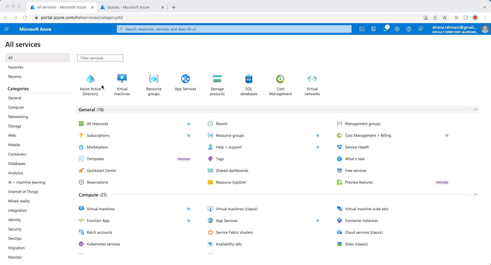
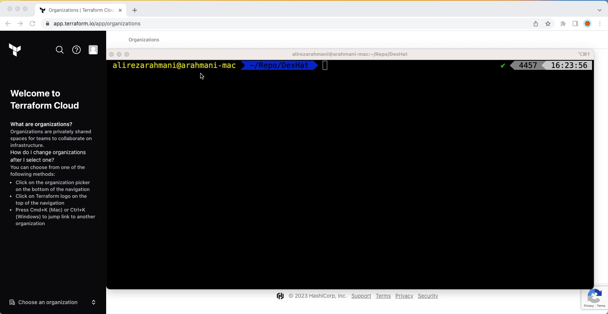

# Terraforming  Azure Red Hat OpenShift(ARO) with GitHub Actions

Deploying Azure RedHat Openshift with Terraform and Integrating with GitHub Actions
Terraforming  Azure Red Hat OpenShift(ARO) with GitHub Actions

## Introduction

By combining Infrastructure as Code with Continuous Integration and Continuous Delivery and/or Deployment  [CI/CD](https://www.redhat.com/en/topics/devops/what-is-ci-cd) in cloud platforms, organizations can achieve a highly automated and streamlined software development and delivery process. Developers can use code to define and provision infrastructure resources, and use CI/CD to continuously integrate code changes and test the software. This approach can help organizations to achieve faster and more reliable software delivery, as well as improve the overall quality of their software.

## What will be covered

Many organizations use [GitHub Actions](https://docs.github.com/en/actions/learn-github-actions/understanding-github-actions) and [Terraform](https://developer.hashicorp.com/terraform/intro) to deploy solutions in [Azure](https://azure.microsoft.com/en-ca/resources/cloud-computing-dictionary/what-is-azure/) as best practices to achieve collaboration, automation and scalability and security

In this blog post, we are going to learn how to deploy Azure Red Hat OpenShift (ARO) with Terraform and integrate it with Terraform Cloud and GitHub Actions.

If you want to learn about ARO you can get more information [here](https://www.redhat.com/en/technologies/cloud-computing/openshift/azure).

**Note** : [Azure-Samples/aro-azapi-terraform](https://github.com/Azure-Samples/aro-azapi-terraform) has been used for Terraform code as referenced in this post. 

## Dataflow

1. Create a new branch from the main and modify the code. As an example changing the work node instance type or subnet address.
2. Create a pull request(PR) to the new branch
3. GitHub Actions workflow will be triggered to guarantee that your code is correctly formatted, consistent internally, and results in a secure infrastructure.
4. Create PR to merge into the main branch
5. GitHub Actions workflow will be triggered to run a terraform plan. The result of Terraform plan will be accessible in both GitHub Actions and Terraform cloud workspace. 
6. After reviewing PR by the team and merging to the main branch, Terraform apply will execute.
7. Terraform will deploy Red Hat OpenShift to Azure 

## Workflow

For maintaining code quality, preventing accidental changes, enforcing policies, collaborating more effectively and as a best practice, it’s recommended that developers not push directly to the main branch.  

By using protected branches, teams can ensure that critical branches are properly managed and maintained, which can lead to a more stable and reliable codebase over time.

The infrastructure team should create a new branch from main and apply changes to it, then push to feature/development branch. Pushing to branch will trigger Terraform-UnitTests.

After running Terraform-UnitTests successfully, the infrastructure team can create a pull request which will trigger Terraform-Push. 

We will use two workflows:

- **Terraform-UnitTests.yml** : The purpose of this workflow is to run unit tests on push into any branch.  As part of this workflow’s Terraform validation, the format and security scans will be checked. 

- **Terraform-Push.yml** : This workflow has two phases, one for push and one for merge. 
Based on each push from feature/development branches to the main branch, this workflow will trigger and run the `terraform plan` command. 
After a successful push, when a merge request is submitted this workflow will trigger the `terraform apply` command.

## Prerequisites:

- [Azure Account](https://azure.microsoft.com/en-ca/free/) with active subscription

- [Terraform Cloud account](https://app.terraform.io/session)

- [GitHub account](https://github.com/login)

- [Visual Studio Code](https://code.visualstudio.com/download) + [Git](https://git-scm.com/downloads) + [Azure CLI](https://learn.microsoft.com/en-us/cli/azure/install-azure-cli) + [Terraform CLI](https://developer.hashicorp.com/terraform/downloads) installed in local workstation

- [Red Hat account](https://www.redhat.com/wapps/ugc/register.html?_flowId=register-flow&_flowExecutionKey=e1s1)  

To enhance the readability of this blog post, references to both the command-line interface (CLI) and graphical user interface (GUI) have been provided for creating resources.

## Steps:

1- **[Install Azure CLI](https://learn.microsoft.com/en-us/cli/azure/install-azure-cli)**

Azure CLI is a command-line interface for managing resources in Microsoft Azure, which is Microsoft's cloud computing platform

2- **[Increase limits by VM series](https://learn.microsoft.com/en-us/azure/quotas/per-vm-quota-requests)**

Increasing limits by VM series for ARO installation is necessary to ensure that your ARO cluster has the resources it needs to operate efficiently and reliably. 

[Standard DSv3 Family vCPUs](https://learn.microsoft.com/en-us/azure/quotas/per-vm-quota-requests) = 150  
[Total Regional vCPUs](https://learn.microsoft.com/en-us/azure/quotas/per-vm-quota-requests) = 200

3- **[Get a Red Hat pull secret](https://learn.microsoft.com/en-us/azure/openshift/tutorial-create-cluster#get-a-red-hat-pull-secret-optional)**

[Navigate to your Red Hat OpenShift cluster manager portal](https://console.redhat.com/openshift/install/azure/aro-provisioned) and sign-in. Download the pull secret. We are going to use this secret in the Terraform Cloud while provisioning the ARO cluster. 

4- **Fork and Clone Github repository** 

Fork the following repository in your GitHub account  and clone it in your local workstation.
https://github.com/DexHat/aro-terra-gitactions

After cloning in the local workstation update your .gitignore with following information.updated .gitignore file is part of repository.

**Secrets**

pull-secret*
variables_secrets*

5- **Run create.sh script**

Run  create.sh file with following command:

 `sh create.sh`

create.sh file will:

- Create  variables-secrets file
- Register necessary service providers
- Create service principal and assign contribute and system administrator role to it
- Generate variables for Terraform Cloud, GitHub Actions and tfvars.

6- **Terraform Cloud Sign-up** 

To integrate between Terraform and GitHub Actions, we are going to use [Terraform Cloud](https://www.terraform.io/) 

- [Signup](https://app.terraform.io/session) for terraform cloud new account 
- Choose an organization or [create an organization](https://developer.hashicorp.com/terraform/cloud-docs/users-teams-organizations/organizations#creating-organizations) 

- [Create a new workspace](https://developer.hashicorp.com/terraform/cloud-docs/workspaces/creating#create-a-workspace) and select [API-driven](https://developer.hashicorp.com/terraform/cloud-docs/run/api) as a workflow type

7- **Copy and set variables and secrets**

Copy the following variables and secrets from the variables_secrets file and set them in Terraform Cloud workspace level:

**Terraform Variables:**

- aro_cluster_aad_sp_client_id = Service Principal Application (client) ID
- aro_cluster_aad_sp_client_secret =  Service Principal Secret Value
- aro_cluster_aad_sp_object_id = Service Principal Object ID
- aro_rp_aad_sp_object_id = Azure Red Hat OpenShift Resource Provider Object ID
- pull_secret = xxxxx

**Environment Variables:**

- ARM_CLIENT_ID =  Service Principal Application (client) ID
- ARM_CLIENT_SECRET = Service Principal Secret Value
- ARM_SUBSCRIPTION_ID = Azure Subscription ID
- ARM_TENANT_ID = Azure Tenant ID 

For more information about sensitive variables in Terraform, please check [Protect Sensitive Input Variables](https://developer.hashicorp.com/terraform/tutorials/configuration-language/sensitive-variables).
Since we are going to use Terraform Cloud, we will set all variables at the workspace level.

 Log into Terraform Cloud => choose Organization => select Workspace => Variables

8- **Install Terraform CLI**

Terraform CLI is a powerful tool for managing infrastructure as code, allowing users to version control infrastructure changes, collaborate more effectively, and automate the deployment and management of infrastructure resources. Install Terraform CLI from [here](https://developer.hashicorp.com/terraform/tutorials/aws-get-started/install-cli#install-terraform).

- **Integrating Terraform Cloud and GitHub Actions**

After installing Terraform CLI locally, run `terraform login` to create a token.

Generated token will be used to integrate with GitHub Actions as CI/CD pipeline.
Under GitHub repository - Secrets and Variables - Actions, create TF_API_TOKEN secret and copy value from previous step to here. 

- In GitHub under Environments, create Development environment
- Copy the following variables and secrets from variables_secrets file and set them under GitHub repository

- ARM_CLIENT_ID =  Service Principal Application (client) ID
- ARM_CLIENT_SECRET = Service Principal Secret Value
- ARM_SUBSCRIPTION_ID = Azure Subscription ID
- ARM_TENANT_ID = Azure Tenant ID 

- In your local workstation, copy the following variables and secrets from variables_secrets file and set them in Development/tfvars file

domain
location
resource_group_name
resource_prefix
virtual_network_address_space
master_subnet_address_space
worker_subnet_address_space

## Conclusion 

In conclusion, the use of GitHub Actions and Terraform Cloud together can provide a powerful solution for deploying and managing Azure Red Hat OpenShift (ARO) clusters. GitHub Actions provides a way to automate and streamline the process of managing code changes and deployments, while Terraform Cloud provides a way to manage infrastructure as code in a scalable and efficient manner. Azure, as a cloud provider, offers a robust platform for hosting and managing ARO clusters. By leveraging these tools and services, organizations can deploy and manage ARO clusters more efficiently, with greater consistency and control, and with the ability to easily scale up or down as needed. 
